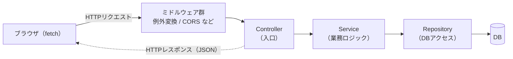
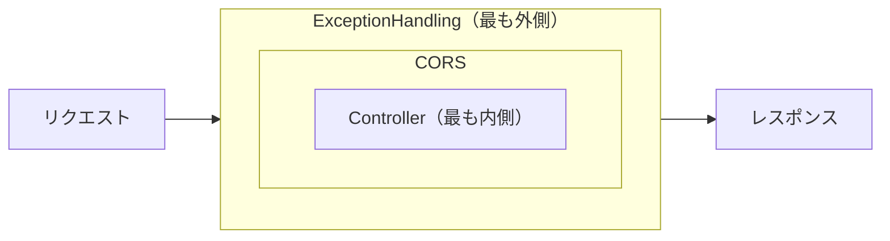
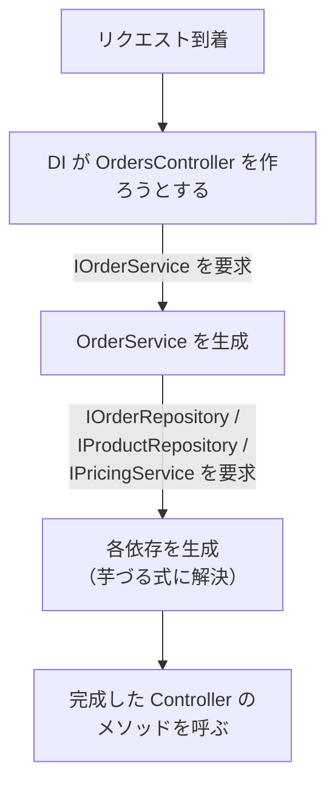
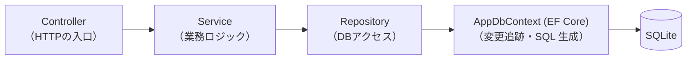

# ASP.NET Core 入門（このプロジェクトのコードで学ぶ）

ASP.NET Core は、.NET で **Web API や Web アプリを作るためのフレームワーク** です。

ひとことで言うと <br>
**「HTTP リクエストを受け取って、対応する C# のメソッドを呼び、結果を HTTP レスポンスとして返す」** <br>仕組みをまとめて提供してくれるものです。

この資料は、このリポジトリ（ミニ EC の注文 API）の **実際のコード** を読みながら、ASP.NET Core の基本を順番に理解することを目的にしています。<br>
コードを読む前提知識として、最初に一度通して読んでください。

DB まわり（EF Core / Repository）は別資料の [entity-framework-入門.md](entity-framework-入門.md) が担当します。この資料は **「HTTP が入ってきてから、業務ロジックを呼ぶ手前まで」** ——つまり Controller から上の層を扱います。

> 対象バージョン: ASP.NET Core（.NET 8）<br>
`src/TrainingBackend.csproj` の `<TargetFramework>net8.0</TargetFramework>`、Web SDK（`Microsoft.NET.Sdk.Web`）を使っています。

---

## 0. 全体像：リクエストが通る道

ブラウザ（フロント）からの 1 回の HTTP リクエストは、次の順で処理されます。



この資料で押さえる登場人物は次のとおりです。

| 登場人物 | 役割 | このプロジェクトの例 |
|---|---|---|
| **`Program.cs`** | 起動役。設定・DI 登録・パイプライン組み立て | `src/Program.cs` |
| **ミドルウェア** | 全リクエストが順に通る共通処理 | `ExceptionHandlingMiddleware`, CORS, Swagger |
| **Controller** | URL とメソッドを結びつける入口 | `ProductsController`, `OrdersController`, `CouponsController` |
| **DTO** | API の入出力に使う専用のデータ型 | `ProductDto`, `CreateOrderRequest`（`src/Dtos/`） |
| **DI コンテナ** | 必要なクラスを生成して渡す | `builder.Services.Add...`（`src/Program.cs`） |

「HTTP という文字列のやりとり」を「C# のメソッド呼び出しと戻り値」に変換してくれるのが ASP.NET Core だ、と捉えてください。

---

## 1. Program.cs：アプリの組み立て図

.NET 8 のアプリは `src/Program.cs` 1 ファイルで起動します。<br>
中身は大きく **「① 部品を登録する（build 前）」** と **「② リクエストの通り道を組む（build 後）」** の 2 部構成です。

```csharp
var builder = WebApplication.CreateBuilder(args);

// ① ここから build まで：使う部品を「登録」するフェーズ
builder.Services.AddCors(/* ... */);       // CORS
builder.Services.AddDbContext<AppDbContext>(/* ... */);  // DB
builder.Services.AddScoped<IOrderService, OrderService>();  // 業務ロジック
builder.Services.AddControllers();         // コントローラ機能
builder.Services.AddSwaggerGen(/* ... */); // Swagger

var app = builder.Build();   // ← ここで箱が組み上がる

// ② ここから Run まで：リクエストが通る「パイプライン」を組むフェーズ
app.UseMiddleware<ExceptionHandlingMiddleware>();
app.UseSwagger();
app.UseSwaggerUI();
app.UseCors(FrontendCorsPolicy);
app.MapControllers();

app.Run();   // ← サーバー起動、リクエスト待ち受け開始
```

区別のポイントは接頭辞です。

- **`builder.Services.Add～`** … 「この機能を使えるように登録しておいて」（DI コンテナへの登録）。
- **`app.Use～` / `app.Map～`** … 「リクエストが来たらこの順で処理して」（パイプラインの組み立て）。

`build()` を境に前半・後半で意味が変わる、と覚えると読みやすくなります。

---

## 2. ミドルウェア：全リクエストが順番に通る処理

**ミドルウェア（middleware）** は、すべてのリクエストが**順番に**通過する共通処理です。<br>
`app.Use～` で並べた **順番がそのまま実行順** になります。

```csharp
app.UseMiddleware<ExceptionHandlingMiddleware>();  // ① 例外を捕まえる網（いちばん外側）
app.UseSwagger();                                   // ② /swagger のドキュメント
app.UseSwaggerUI();
app.UseCors(FrontendCorsPolicy);                    // ③ CORS の許可判定
app.MapControllers();                               // ④ 最後にコントローラへ振り分け
```

イメージは「玉ねぎの皮」です。リクエストは外側の皮から順に内側へ進み、いちばん奥の Controller で処理され、レスポンスは逆順で外側へ戻ります。



外側の皮から順に内側の Controller へ入り、レスポンスは同じ皮を逆順に通って戻ります。

だから **例外処理を最初（いちばん外側）に置く** のが重要です。奥の Controller / Service で投げられた例外は、戻る途中でいちばん外側の網に必ず引っかかります。

### 自作ミドルウェアの中身

`src/Middleware/ExceptionHandlingMiddleware.cs`:

```csharp
public async Task InvokeAsync(HttpContext context)
{
    try
    {
        await _next(context);   // ← 内側（次のミドルウェア〜Controller）を呼ぶ
    }
    catch (NotFoundException ex)
    {
        await WriteProblemAsync(context, StatusCodes.Status404NotFound, ex.Message);
    }
    catch (BusinessRuleException ex)
    {
        await WriteProblemAsync(context, StatusCodes.Status400BadRequest, ex.Message);
    }
    catch (Exception ex)
    {
        _logger.LogError(ex, "未処理の例外が発生しました。");
        await WriteProblemAsync(context, StatusCodes.Status500InternalServerError, "サーバー内部でエラーが発生しました。");
    }
}
```

- `_next(context)` が「内側の処理を実行する」呼び出しです。これを `try` で囲んでいるので、**奥で投げられた例外がここに戻ってくる** と捕まえられます。
- `NotFoundException` → 404、`BusinessRuleException` → 400、それ以外 → 500、と **例外の種類を HTTP ステータスに翻訳** しています。
- レスポンスは `{ status, error }` の JSON に統一されます。

この仕組みのおかげで、**Controller に try/catch を一切書かずに済みます**（次章）。例外設計の詳細は [entity-framework-入門.md](entity-framework-入門.md) ではなく `src/Exceptions/AppExceptions.cs` と CLAUDE.md の「エラー処理の規約」を参照してください。

---

## 3. Controller：URL と C# メソッドを結ぶ

**Controller** は API の入口です。「どの URL に、どの HTTP メソッド（GET/POST/...）で来たら、どの C# メソッドを呼ぶか」を **属性（attribute）** で宣言します。

`src/Controllers/ProductsController.cs`:

```csharp
[ApiController]
[Route("api/products")]      // このクラスの基準 URL
public class ProductsController : ControllerBase
{
    private readonly IProductRepository _productRepository;

    // DI が IProductRepository を渡してくれる（自分で new しない）
    public ProductsController(IProductRepository productRepository)
    {
        _productRepository = productRepository;
    }

    [HttpGet]                              // GET api/products
    public async Task<ActionResult<IEnumerable<ProductDto>>> GetAll() { /* ... */ }

    [HttpGet("{id:int}")]                  // GET api/products/42
    public async Task<ActionResult<ProductDto>> GetById(int id) { /* ... */ }

    [HttpPut("{id:int}/price")]            // PUT api/products/42/price
    public async Task<ActionResult<ProductDto>> UpdatePrice(int id, [FromBody] UpdateProductPriceRequest request) { /* ... */ }
}
```

### ルーティング（URL の組み立て）

URL は **クラスの `[Route]` ＋ メソッドの `[Http～]`** をつなげて決まります。

| 属性 | 意味 | できあがる URL |
|---|---|---|
| `[Route("api/products")]` | クラスの基準パス | `api/products` |
| `[HttpGet]` | GET・追加パスなし | `GET api/products` |
| `[HttpGet("{id:int}")]` | GET・`{id}` を追加 | `GET api/products/42` |
| `[HttpPut("{id:int}/price")]` | PUT・`{id}/price` を追加 | `PUT api/products/42/price` |

- `{id:int}` の `:int` は **ルート制約**。「`id` は整数のときだけこのメソッドに来る」という指定です。`/api/products/abc` は数値でないので当たりません。
- `[HttpGet]`（追加なし）と `[HttpGet("{id:int}")]` のように、**メソッドと追加パスの組み合わせ** で行き先が分かれます。

### ControllerBase と [ApiController]

- `ControllerBase` を継承すると、`Ok(...)` / `CreatedAtAction(...)` などのレスポンス補助メソッドが使えます（画面（View）を返さない API 用の基底クラス）。
- `[ApiController]` を付けると、**入力の自動検証**（第 5 章）など Web API 向けの便利な振る舞いが有効になります。

### 「薄い Controller」という約束

このプロジェクトの Controller には、業務ロジックも try/catch も書きません。**受け取って → Service（か Repository）を呼んで → 結果を返すだけ** です。

`src/Controllers/OrdersController.cs`:

```csharp
[HttpPost]
public async Task<ActionResult<OrderDto>> Create([FromBody] CreateOrderRequest request)
{
    var order = await _orderService.CreateAsync(request);   // 業務判断は Service に丸投げ
    return CreatedAtAction(nameof(GetById), new { id = order.Id }, order);
}
```

在庫チェックやクーポン適用の判断は `OrderService` にあり、Controller はそれを呼ぶだけです。「業務ルールを直したい → Service を見る」「入口の URL や返し方を直したい → Controller を見る」と探し場所が分かれます。

---

## 4. モデルバインドと DTO：JSON ⇄ C# オブジェクト

Controller のメソッドの引数には、リクエストの中身が **自動で詰められて** 渡ってきます。これを **モデルバインド（model binding）** と呼びます。

引数がどこから来るかは、URL の形と属性で決まります。

| 例 | どこから来るか |
|---|---|
| `GetById(int id)` ＋ `[HttpGet("{id:int}")]` | **URL のパス**（`/api/products/42` の `42`） |
| `Create([FromBody] CreateOrderRequest request)` | **リクエストボディの JSON** |

`[FromBody]` を付けた引数は、**送られてきた JSON を自動で C# オブジェクトに変換（デシリアライズ）** して受け取ります。

```jsonc
// フロントが POST /api/orders で送る JSON
{
  "items": [ { "productId": 1, "quantity": 2 } ],
  "couponCode": "WELCOME"
}
```

これが `CreateOrderRequest` に対応します。`src/Dtos/CreateOrderRequest.cs`:

```csharp
public class CreateOrderRequest
{
    public List<CreateOrderItemRequest> Items { get; set; } = new();
    public string? CouponCode { get; set; }
}
```

- JSON の `items` / `couponCode`（キャメルケース）と、C# の `Items` / `CouponCode`（パスカルケース）は **自動で対応** します。
- 逆に、Controller が返したオブジェクトは **自動で JSON に変換（シリアライズ）** されてレスポンスになります。

### なぜエンティティでなく DTO を使うのか

API の入出力には、DB テーブルそのものである **エンティティ**（`Product`, `Order`）ではなく、専用の **DTO（Data Transfer Object）** を使います（`src/Dtos/`）。

`src/Controllers/ProductsController.cs`:

```csharp
var products = await _productRepository.GetAllAsync();   // ← Product エンティティ
var dtos = products.Select(p => new ProductDto(p.Id, p.Name, p.Price, p.Stock));  // ← DTO に詰め替え
return Ok(dtos);
```

DTO を挟む理由:

- **返しすぎ防止** … エンティティには外部に見せたくない項目や、ナビゲーションプロパティ（つながり先オブジェクト）が含まれます。DTO なら「返す項目」を明示的に選べます。
- **入出力の形を固定できる** … DB の都合（列の追加など）と API の形を切り離せます。
- **循環参照を避ける** … `Order → Items → Order → ...` のように相互に参照するエンティティをそのまま JSON 化すると無限ループになりがちです。

出力用 DTO は `record` 型で簡潔に定義されています。`src/Dtos/ProductDto.cs`:

```csharp
public record ProductDto(int Id, string Name, decimal Price, int Stock);
```

入力（`CreateOrderRequest`）と出力（`OrderDto`）で **別の DTO** を使っているのもポイントです。求める形が違うからです。

---

## 5. 入力チェック（バリデーション）：[ApiController] の自動検証

「数量は 1 以上」「注文には商品を 1 つ以上」といった **入力の形式チェック** は、DTO のプロパティに **属性** を付けるだけで宣言できます。

`src/Dtos/CreateOrderRequest.cs`:

```csharp
public class CreateOrderItemRequest
{
    [Required]
    public int ProductId { get; set; }

    [Range(1, int.MaxValue, ErrorMessage = "数量は 1 以上で指定してください。")]
    public int Quantity { get; set; }
}

public class CreateOrderRequest
{
    [Required]
    [MinLength(1, ErrorMessage = "注文には商品を 1 つ以上含めてください。")]
    public List<CreateOrderItemRequest> Items { get; set; } = new();

    public string? CouponCode { get; set; }
}
```

- `[Required]` … 必須。
- `[Range(1, ...)]` … 数値の範囲。
- `[MinLength(1)]` … リストや文字列の最小長。

これらは `System.ComponentModel.DataAnnotations` の **データアノテーション** と呼ばれる属性です。

### 誰がチェックしているのか

`[ApiController]` が付いた Controller では、**モデルバインドの直後に自動で検証が走ります**。<br>
検証に引っかかると、Controller のメソッドは **呼ばれずに** 自動で `400 Bad Request` が返ります。<br>
だから Controller の中に「if で null チェック」のようなコードは書かれていません。

> **形式のチェック**（数量が 1 以上か、必須項目があるか）は属性で自動化。<br>
> **業務のチェック**（在庫が足りるか、クーポンが有効か）は Service 層で `BusinessRuleException` を投げる。<br>
> ——この 2 段構えになっています。実際、`OrderService.CreateAsync` でも在庫不足やクーポン無効を業務チェックとして再度見ています。

---

## 6. レスポンスの返し方：ActionResult とステータスコード

Controller の戻り値の型は `Task<ActionResult<T>>` の形が基本です。`ActionResult` は **「HTTP レスポンスそのもの（本文＋ステータスコード）」** を表します。

このプロジェクトで使われている返し方:

| 書き方 | 意味 | HTTP ステータス |
|---|---|---|
| `return Ok(dto);` | 成功。本文に `dto` | 200 OK |
| `return CreatedAtAction(nameof(GetById), new { id = order.Id }, order);` | 作成成功。作った物の場所も示す | 201 Created |

`src/Controllers/OrdersController.cs`:

```csharp
[HttpPost]
public async Task<ActionResult<OrderDto>> Create([FromBody] CreateOrderRequest request)
{
    var order = await _orderService.CreateAsync(request);
    return CreatedAtAction(nameof(GetById), new { id = order.Id }, order);
}
```

- `CreatedAtAction` は 201 を返しつつ、レスポンスヘッダに **「作成したリソースの URL」**（この場合 `GET api/orders/{id}`）を入れてくれます。「作った物はここで取れますよ」を示す作法です。

### エラー時のステータスはどうなる？

**Controller ではエラーレスポンスを組み立てません。** 異常時は Service が例外を投げ、第 2 章の `ExceptionHandlingMiddleware` がステータスに変換します。

`src/Controllers/ProductsController.cs`:

```csharp
var product = await _productRepository.GetByIdAsync(id)
    ?? throw new NotFoundException($"商品が見つかりません (ProductId: {id})");
// ↑ 見つからなければ例外を投げるだけ。404 への変換はミドルウェアがやる
```

つまり Controller は **正常系だけを書き、異常系は「例外を投げて丸投げ」** する構造です。

---

## 7. DI：コントローラに部品が届くまで

Controller は必要な部品（Service や Repository）を **自分で `new` しません**。<br>
**DI（依存性注入）コンテナ** が生成して、コンストラクタに渡してくれます。

`src/Program.cs` で登録し（build 前フェーズ）:

```csharp
builder.Services.AddScoped<IProductRepository, ProductRepository>();
builder.Services.AddScoped<IOrderService, OrderService>();
// ...
builder.Services.AddControllers();
```

Controller はコンストラクタで **interface を要求するだけ**:

```csharp
public OrdersController(IOrderService orderService)   // ← 実装は DI が渡す
{
    _orderService = orderService;
}
```

流れはこうです。



- **interface で受け取る** ので、実装を差し替えやすい（テストで偽物を渡す、など）作りになっています。実際、`src/Program.cs` は必ず `interface, 実装` のペアで登録しています。
- `AddScoped` は **「1 リクエストにつき 1 個だけ作って使い回す」** 生存期間です。DbContext を Scoped で登録している理由（1 リクエスト = 1 DbContext）は [entity-framework-入門.md](entity-framework-入門.md) の DI の章を参照してください。

---

## 8. CORS：フロントからのアクセスを許可する

フロント（training-frontend）は **このサーバーと別オリジン**（別ポート）で動きます。ブラウザは安全のため、別オリジンへの `fetch` を既定でブロックします（**同一オリジンポリシー**）。<br>
これを明示的に許可する仕組みが **CORS（Cross-Origin Resource Sharing）** です。

登録（build 前）—— `src/Program.cs`:

```csharp
var allowedOrigins = builder.Configuration
    .GetSection("Cors:AllowedOrigins")
    .Get<string[]>() ?? Array.Empty<string>();

builder.Services.AddCors(options =>
{
    options.AddPolicy(FrontendCorsPolicy, policy =>
    {
        policy.WithOrigins(allowedOrigins)   // 許可するフロントのオリジン
            .AllowAnyHeader()
            .AllowAnyMethod();
    });
});
```

有効化（build 後・パイプライン）:

```csharp
app.UseCors(FrontendCorsPolicy);
```

- 許可するオリジンは **設定ファイル**（`src/appsettings.json` の `Cors:AllowedOrigins`）から読み込みます。コードに直書きしていません。
- 研修で受講者が CORS エラーに詰まらないよう、フロントのオリジンを **最初から許可した状態** にしてあります。

> `builder.Configuration.GetSection(...)` のように、設定は `appsettings.json` から型付きで読めます。接続文字列（`GetConnectionString`）も同じ設定の仕組みです。

---

## 9. Swagger：API を画面から試す

**Swagger（OpenAPI）** は、この API の一覧・入出力の形を **自動でドキュメント化** し、ブラウザから試せる画面を出してくれるツールです。

`src/Program.cs`:

```csharp
// 登録（build 前）
builder.Services.AddEndpointsApiExplorer();
builder.Services.AddSwaggerGen(c =>
{
    c.SwaggerDoc("v1", new() { Title = "Training Mini-EC API", Version = "v1" });
});

// 有効化（build 後）
app.UseSwagger();
app.UseSwaggerUI();
```

起動後、ブラウザで **http://localhost:5000/swagger** を開くと、各 API を一覧・実行できます。

- Controller の属性（`[HttpGet]` など）や DTO の形から **自動生成** されます。手書きのドキュメントではありません。
- `/// <summary>...</summary>` の XML コメント（各 Controller メソッドに付いている説明）も説明文として表示されます。
- **DB を用意しなくても、まず Swagger で API を叩いて挙動を確かめる** のが、このプロジェクトを触り始める近道です。

---

## 10. リクエスト 1 本の一生（POST /api/orders を例に）

ここまでの登場人物が、1 回の注文作成でどう連携するかを通して追います。

1. フロントが `POST /api/orders` に JSON（`items`, `couponCode`）を送る。
2. **`ExceptionHandlingMiddleware`** の `try` の中に入る（いちばん外側）。
3. **CORS** がオリジンを確認して通す。
4. **ルーティング** が `[HttpPost]` の付いた `OrdersController.Create` を選ぶ。
5. **モデルバインド** が JSON を `CreateOrderRequest` に変換して引数に詰める。
6. **`[ApiController]` の自動検証** が `[Required]` / `[Range]` などをチェック。ダメなら即 400（Controller は呼ばれない）。
7. `Create` が **`OrderService.CreateAsync`** を呼ぶ（在庫チェック・クーポン適用・合計計算・保存＝業務ロジック）。
8. 途中で在庫不足なら Service が `BusinessRuleException` を投げる → **手順 2 の網** が捕まえて 400 に変換。
9. 正常なら Service が **`OrderDto`** を返す。
10. Controller が `CreatedAtAction(...)` で **201 Created** として返す。
11. 戻り値の `OrderDto` が **自動で JSON にシリアライズ** され、レスポンスボディになる。
12. レスポンスがミドルウェアを逆順に通ってブラウザへ。

この 1 本の流れが、そのまま各章の内容の総復習になっています。

---

## 11. このプロジェクトでの層の分かれ方（再掲）



- **Controller**（`src/Controllers/`）……この資料の主役。URL・入出力 DTO・レスポンスの返し方。**ロジックも try/catch も書かない。**
- **Service**（`src/Services/`）……業務判断。異常時は `NotFoundException` / `BusinessRuleException` を投げる。→ [entity-framework-入門.md](entity-framework-入門.md)・CLAUDE.md 参照。
- **Repository**（`src/Repositories/`）……EF Core を直接触る唯一の層。→ [entity-framework-入門.md](entity-framework-入門.md)。

「入口・URL・返し方を直す → Controller」「業務ルールを直す → Service」「DB アクセスを直す → Repository」と、探す場所が分かれています。

---

## 12. つまずきやすいポイント（FAQ）

**Q. リクエストを送ったのに Controller のメソッドが呼ばれない。**<br>
A. まず URL と HTTP メソッドの組み合わせ（ルーティング）を確認。`{id:int}` の制約に合わない値（例: `/api/products/abc`）は当たりません。それも合っていれば `[ApiController]` の自動検証で 400 になっている可能性大（第 5 章）。

**Q. try/catch が Controller にないのに、なぜエラーが 404 / 400 で返るの？**<br>
A. Service が例外を投げ、いちばん外側の `ExceptionHandlingMiddleware` が捕まえてステータスに変換しているからです（第 2 章）。Controller は正常系だけ書きます。

**Q. なぜエンティティをそのまま返さず DTO に詰め替えるの？**<br>
A. 返す項目を選べる・API の形を固定できる・ナビゲーションプロパティの循環参照を避けられる、の 3 点です（第 4 章）。入力用と出力用で別 DTO を使うのも同じ理由。

**Q. ブラウザのコンソールに CORS エラーが出る。**<br>
A. フロントのオリジンが許可されていません。`src/appsettings.json` の `Cors:AllowedOrigins` に追加します（第 8 章）。

**Q. `builder.Services.Add～` と `app.Use～` の違いは？**<br>
A. `build()` の前が「部品の登録（DI）」、後が「リクエストの通り道の組み立て（パイプライン）」です（第 1 章）。`app.Use～` は **並べた順に実行** される点も重要。

**Q. Controller が Service や Repository をどこで受け取っているの？**<br>
A. コンストラクタです。`new` はせず、`Program.cs` で登録した実装を DI が渡します（第 7 章）。

---

## 13. まとめ：最低限これだけ

1. **`Program.cs`** は「① `Add～` で部品登録 → ② `Use～`/`Map～` でパイプライン組み立て → `Run`」の順。

2. **ミドルウェア** は全リクエストが順番に通る網。**例外処理をいちばん外側** に置くのがこのプロジェクトの肝。

3. **Controller** は属性（`[Route]`/`[HttpGet]` など）で URL とメソッドを結ぶ入口。**薄く保ち、ロジックも try/catch も書かない。**

4. **モデルバインド** が JSON ⇄ C# を自動変換。入出力には **DTO** を使う。

5. **入力の形式チェックは属性 ＋ `[ApiController]` の自動検証**。業務チェックは Service で例外を投げる。

6. **レスポンスは `ActionResult`**（`Ok` / `CreatedAtAction`）。異常時は例外を投げてミドルウェアに任せる。

7. **DI** が Controller に部品を渡す。自分で `new` しない。

8. **CORS / Swagger** は `Program.cs` で登録＋有効化。まず Swagger で API を叩いてみるのが近道。

まずは `src/Program.cs` と `src/Controllers/` の 3 ファイルを、この資料を片手に読んでみてください。DB 側に進みたくなったら [entity-framework-入門.md](entity-framework-入門.md) へ。
